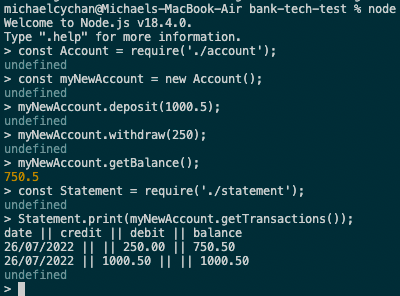
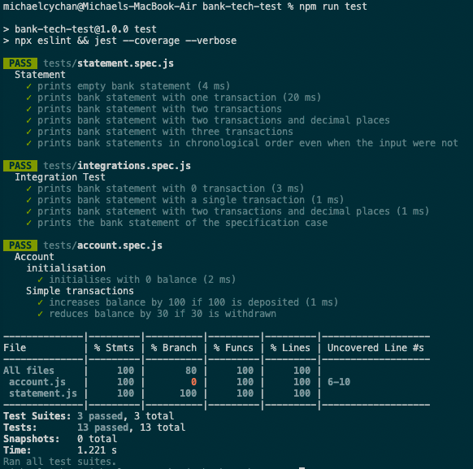

# Bank Tech Test

This is an Individual Technical Challenge at Week 10 in Makers Academy Bootcamp. This programme allows users to interact via a REPL (Node.js) to simulate bank transactions.

Link to all Individual technical challenges: https://github.com/makersacademy/course/tree/main/individual_challenges

## Tools
This programme runs on Node.js. 
The program is written in Javascript.
Jest is used for Unit Testing.
ESLint is used for Checking Syntax.

## Methodology
I adhered to the TDD (test-driven development) principles. New tests were written as a guide for development, then the program is developed to pass the tests. 

The program also follows the OO design (Object-oriented design). The bank accounts are desigend to be instances of the Account Class, and the available actions of the accounts are functions of the Account Class. The Account Class holds an array of transactions. 

This program now consists of one class, therefore testing is relatively simple, one testing suite would suffice to test the Account Class. Integration tests are not needed.

### Note on the Class structure
There was an attempt to make each transaction one instance. However, the current design is that the transactions are kept as Javascript Objects in an array. Functions responsible for deposits and withdrawals (.deposit() and .withdraw()) are easy to use and understand, there is no need to create another class instance for each transaction. I attempted to refactor a Transaction class to separate each transaction from the current Account class, but that would expand the length of the codes tremendously. 

I think the Account class codebase currently is readable enough. 

## Installation
To run locally, type the following commands in command line:
```
git clone https://github.com/michaelcychan/bank-tech-test.git
npm install
```

## Running the program
In command line, run Node.js:
```
node
```

Once you are inside Node.js, import the Account Class and create a new Account Class instance:
```
> const Account = require('./account');
> const myNewAccount = new Account();
```

## Available commands
You will be able to deposit and withdraw from the bank account. When you deposit money, it is necessary to enter the date in YYYY-MM-DD format.
You can check the account balance or get the full bank statement.
```
> myNewAccount.deposit(1000, '2022-05-03');
undefined
> myNewAccount.withdraw(250, '2022-07-02');
undefined
> myNewAccount.getBalance();
750
> myNewAccount.printStatement();
'date || credit || debit || balance\n' +
  '02/07/2022 || || 250.00 || 750.00\n' +
  '03/05/2022 || 1000.00 || || 1000.00'
```
## Screenshot


## Testing:

To run ESLint and Jest test with coverage:
```
npm run tets
```


Further rules can be applied in the .eslintrc.json file.

## Further Issues

There are no instructions for how to handle cases such as withdrawing money more than the balance. Currently negative balance is allowed, as some accounts allows overdraft. Further changes to the program is possible when there are more detailed specifications from client.